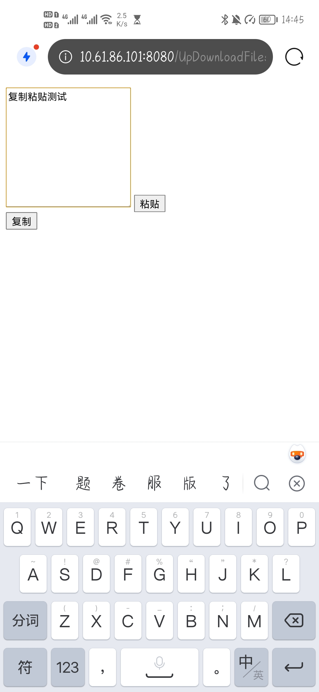

> 卫依--41911087

## 关键功能和代码
由于未掌握Android编程技能，因此考虑采用web实现。

## 1 手机电脑文件互传（局域网内）

通过文件的上传和下载实现。为了保证上传后的文件在手机端和电脑端能够同时显示，利用服务器来存储文件。

将上传后的文件存入服务器中，再从服务器中读取已上传文件列表，将文件列表内存储的所有上传过的文件显示在页面上，实现上传后即可下载。

### 1.1 文件上传

前端利用`form`表单把需要上传的文件传到后端

```html
<form action="UploadServlet" method="post" enctype="multipart/form-data">
<table width="600px" align="center">
	<tr>
		<td>上传文件</td>
		<td><input type="file" name="myfile"></td>
	</tr>
	<tr>
		<td><input type="submit" value="上传"/></td>
	</tr>
</table>
</from>
```

后端解析`request`，得到上传文件对象

```java
//创建DiskFileItemFactory工厂对象
DiskFileItemFactory factory = new DiskFileItemFactory();
//设置文件缓存目录，如果该目录不存在则新创建一个
File f = new File("E:\\TempFolder");
if (!f.exists()) {
    f.mkdirs();
}
//设置文件的缓存路径
factory.setRepository(f);
//创建ServletFileUpload对象
ServletFileUpload fileupload = new ServletFileUpload(factory);
//设置字符编码
fileupload.setHeaderEncoding("utf-8");
//解析request，得到上传文件的FileItem对象
List<FileItem> fileitems = fileupload.parseRequest(request);
```

在服务器创建同名文件

```java
//截取出文件名
filename = filename.substring(filename.lastIndexOf("\\")+1);
//在创建服务器创建同名文件
String webPath = "/download/";
String filepath = getServletContext().getRealPath(webPath + filename);
System.out.println(filepath);
//创建文件
File file = new File(filepath);
file.getParentFile().mkdirs();
file.createNewFile();
```

将文件写入服务器的同名文件中

```Java
//获得上传文件流
InputStream in = fileitem.getInputStream();
//使用FileOutputStream打开服务器端的上传文件
FileOutputStream out = new FileOutputStream(file);
//流的对拷
byte[] buffer = new byte[1024];//每次读取1个字节
int len;
//开始读取上传文件的字节，并将其输出到服务端的上传文件输出流中
while ((len = in.read(buffer)) > 0) {
out.write(buffer, 0, len);
}
```

### 1.2 显示上传文件列表

实现用户可下载的交互页面，具体代码如下：

读取服务器中保存的已上传的文件目录，存入数组`files`。

```java
String path = "D:\\tomcat\\apache-tomcat-9.0.63\\webapps\\UpDownloadFiles\\download"; // 路径
File file2 = new File(path);//获取路径  F:测试目录
if (!file2.exists()) {
    System.out.println(path + " not exists");//不存在就输出
    return;
}

File file[] = file2.listFiles();//用数组接收
String[] files = new String [20];
for (int i = 0; i < file.length; i++) {//循环遍历
    File fs = file[i];//获取数组中的第i个
    files[i] = fs.getName();
    System.out.println(files[i]);//直接输出
}
```

把存有文件名的数组传到前端，通过`session`来实现。
```java
request.getSession().setAttribute("files",files);
request.getRequestDispatcher("upload.jsp").forward(request,response);
```

前端获取后端传输的数组。

为了方便展示每一个文件，需要求得已上传的文件数。但由于得到的`files`是一个固定长度的数组，直接用`length`方法求得的结果并非真实文件数，因此通过遍历列表，判断每一个元素（存有每一个文件名）是否为空，以此来求得文件数。

```java
String files[] = (String[])request.getSession().getAttribute("files");
int count = 0;
if(files!=null){
	for(int i=0;i<20;i++){
		if(files[i]!=null){
			count++;
		}
	}
}
```

利用表格，借助`for`循环显示每一个上传文件的文件名、文件类型和下载操作。
```html
<table width="600px" align="center">
	<tr>
		<td>文件ID</td>
		<td>文件名</td>
		<td>文件类型</td>
		<td>操作</td>
	</tr>
	<%for(int i=0;i<count;i++){ %>
	<tr>
		<td><%=i+1 %></td>
		<td><%=files[i] %></td>
		<td><%=files[i].substring(files[i].lastIndexOf(".")+1) %></td>
		<td><a href="DownloadServlet?filename=<%=files[i] %>">下载</a></td>
	</tr>
	<%} %>
</table>
```

### 1.3 文件下载
选择其中一个需要下载的文件，通过超链接跳转到后端，下载文件。
```java
//设置响应消息编码
request.setCharacterEncoding("utf-8");
response.setCharacterEncoding("utf-8");
response.setContentType("text/html;charset=utf-8");
//获取所要下载的文件名称
String filename = request.getParameter("filename");
System.out.println(filename);
//对文件名称编码,实现文件名为中文的文件下载
filename = new String(filename.trim().getBytes("iso8859-1"),"UTF-8");
//下载文件所在目录
String folder = "/download/";
//通知浏览器以下载的方式打开
response.addHeader("Content-Type", "application/octet-stream");
response.addHeader("Content-Disposition", "attachment; filename="+URLEncoder.encode(filename,"utf-8"));
//通过文件流读取文件
System.out.println(folder+filename);
InputStream in = getServletContext().getResourceAsStream(folder+filename);
//获取response对象的输出流
OutputStream out = response.getOutputStream();
byte[] buffer = new byte[1024];
int len;
//循环取出流中的数据
while ((len = in.read(buffer)) != -1) {
    out.write(buffer, 0, len);
}
```

到此，即可实现文件的上传和下载。

由于通过把上传文件存到服务器中，因此可以实现手机端和电脑端各自访问网页，以实现文件和互传。

### 1.4 使用教程

手机端和电脑端各自访问[http://10.61.86.101:8080/UpDownloadFiles/upload.jsp](http://10.61.86.101:8080/UpDownloadFiles/upload.jsp)

电脑端：

1. 点击“选择文件”按钮，即可跳转到文件管理器，选择相应文件
2. 点击上传，即可将文件上传到服务器，并显示在文件下载区

电脑端上传了两个文件


手机端：

手机端上传一个文件后，即可更新文件列表，查看到电脑端上传的两个文件


1. 点击下载按钮进行下载


2. 下载完成


同理，电脑端也可对手机端的文件进行下载


## 2 手机端复制，电脑端粘贴

设置一个可编辑文本框，在文本框内输入需要传输的文字，通过分别在手机端和电脑端执行粘贴和复制操作，即可实现文字的复制粘贴。

为了实现手机端和电脑端各自访问网页实现复制粘贴，利用了上面文件互传的思想，通过把文字存入服务器，再从服务器读取。

### 2.1 复制

前端利用`form`表单把需要粘贴的文字传到后端

```html
<form action="CopyServlet" method="post" name="form1">
	<textarea cols="20" rows="10" name="text"></textarea>
	<input type="submit" value="粘贴"/>
</form>
```

后端获取到文字后，把文字写入`txt`文件，保存到服务器中。
```java
//获取文字内容
String text = request.getParameter("text");
System.out.println(text);
//在服务器端创建文件
String filepath = getServletContext().getRealPath("/copy.txt");
System.out.println(filepath);
File file = new File(filepath);
file.getParentFile().mkdirs();
file.createNewFile();
//使用FileOutputStream打开服务器端的上传文件
FileOutputStream out = new FileOutputStream(file);
//流的对拷
byte[] buffer = new byte[1024];//每次读取1个字节
buffer = text.getBytes();
int len = buffer.length;
//开始读取上传文件的字节，并将其输出到服务端的上传文件输出流中
out.write(buffer, 0, len);
out.close();
//返回前端页面
response.sendRedirect("copy.jsp");
```

### 2.2 粘贴

设置按钮，通过点击按钮跳转到后端

```html
<form action="PasteServlet" method="post" name="form2">
	<input type="submit" onclick="getValue" value="复制"/>
</form>
```

后端从服务器读取文件中的文字，返回前端

```java
String path = "D:\\tomcat\\apache-tomcat-9.0.63\\webapps\\UpDownloadFiles\\copy.txt"; // 路径   
//创建FileReader对象，指定要读取的文件
FileInputStream fin = new FileInputStream(path);
InputStreamReader reader = new InputStreamReader(fin);
BufferedReader buffReader = new BufferedReader(reader);
//通过循环来判断是否读取到文件的末尾
String text = "";
while((text = buffReader.readLine())!=null) {
//把文字返回前端
    request.getSession().setAttribute("text",text);
    request.getRequestDispatcher("copy.jsp").forward(request,response);
}
//关闭流
buffReader.close();
```

前端获取后端传输的文字数据

```java
String text = (String)request.getSession().getAttribute("text");
```

为了实现把文字写入剪贴板的功能，使用了原始的API：
```js
document.execCommand("Copy");
```

该接口有一定的限制，只能复制被选中的文字内容，即只有文字内容被选中后`execCommand`才生效。因此想到把文本内容显示在页面的文本框内，再对文字进行选中、复制等操作。

为了保证页面的美观，考虑到要把该文本框隐藏。而使用`hidden`属性时`execCommand`也不生效，于是有如下：
```html
<textarea rows="10" cols="10" id="demo" style="opacity: 0;position: absolute;"><%=text %></textarea>
```

把文字内容显示到文本框内后，则需要获取该文本框内容并选中文字，访问剪切板，执行复制操作。

而选中文字的操作和将文字放入文本框的操作是异步执行，因此会出现选中的文字为空的情况。

面对该问题，上网查找到了延时操作，可以通过延时，使得程序先执行“把文字放入文本框”的操作，再执行“选中文字复制”的操作。即有如下代码：
```js
setTimeout(function () {
	var text=document.getElementById("demo")
	text.select();
	if(document.execCommand("Copy")){
		alert("复制成功");
	};
}, 300);
```

通过以上操作，实现了手机端复制，电脑端粘贴操作。

其实同样也可以电脑端复制，手机端粘贴。但由于没有找到让手机的浏览器获取剪贴板权限的设置，因此无法验证。

### 2.3 使用教程
手机端和电脑端各自访问[http://10.61.86.101:8080/UpDownloadFiles/copy.jsp](http://10.61.86.101:8080/UpDownloadFiles/copy.jsp)


1. 手机端在框内输入想要粘贴的文字
2. 手机端点击粘贴按钮，把文字写入服务器中

3. 电脑端点击复制按钮，即可把手机端粘贴的文字复制到电脑的剪切板中

